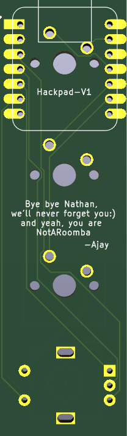
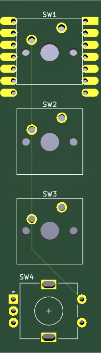
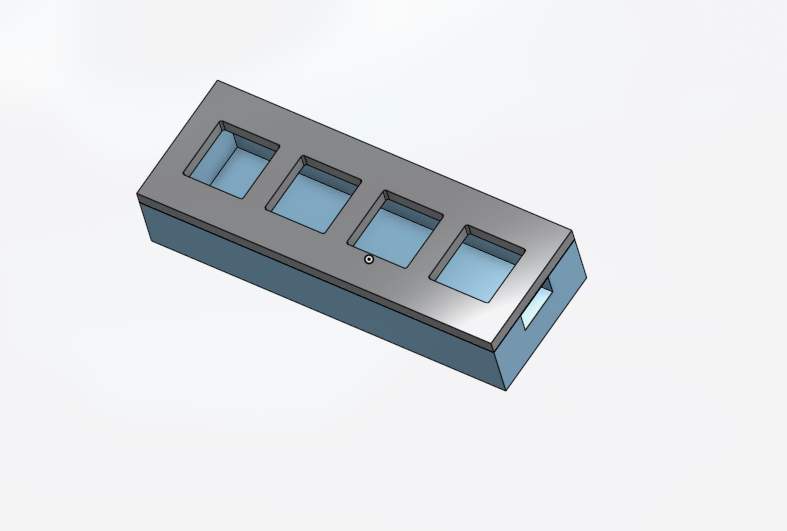

# HackPad V-1

This is my first hardware project where I've made a mini keyboard with 3 switches which can control the music playing like ```skip to next```, ```play previous track```, ```play/pause track``` and rotary switch for ```increasing and decreasing volume``` and ```mute and unmute```.

## Stack:
- QMK for firmware
- XIAO-RP2040 for the main processor
- MX-Style mechanical swtiches for keys
- EC11E Rotary Encoder(with swtich) for the rotary switch

## Demo files


                          



for the actual 3d-model click [here](Hackpad-V1.stl) and download the stl file:)
## Instalation guide
Check [qmk's guide](https://qmk.fm/guide) for firmware flashing.
For firmware check [here](hackpad-v1_firmware)

And as for the pcb part just open it on kicad and edit it or you can just export the gerber files and print them out.

##

That's all, enjoy your hackpad yayayay


## AI Usage
I wrote my firmware with a lilte bit help of AI, like just for understanding C-language